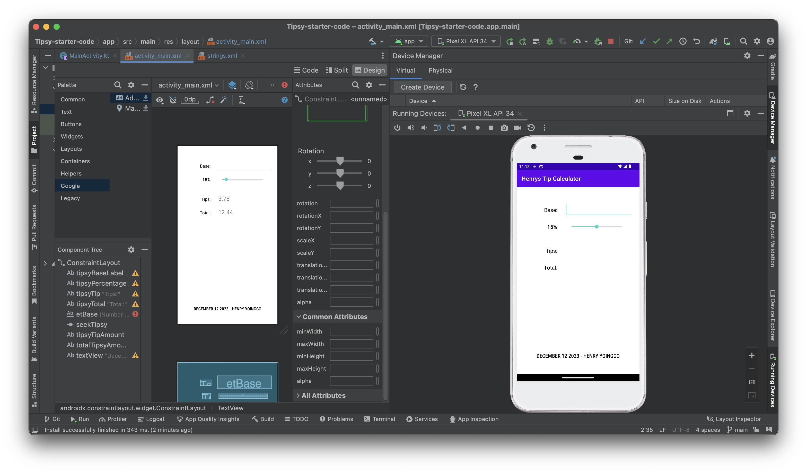
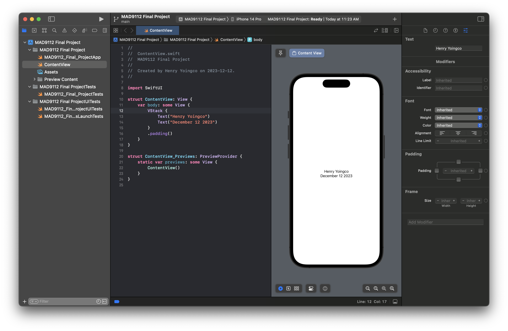

# Henry_Yoingco_FinalProject

````function getDaysUntilChristmas() {
let date = new Date();
let isDay = date.toLocaleString("default", { day: "2-digit" });
let christmasDay = 25;
let daysRemaining = christmasDay - isDay;
return daysRemaining;
}
console.log("Amount of days until Christmas is: " + getDaysUntilChristmas());```




````
